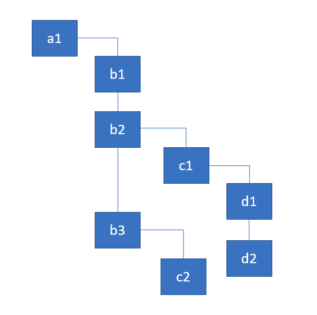
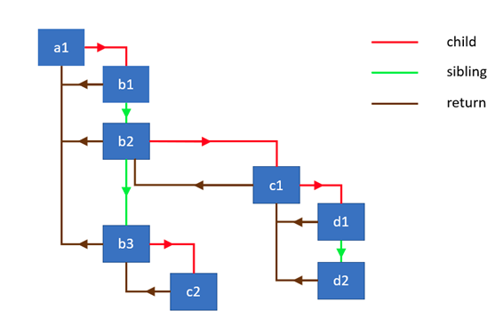

# React-Fiber - 前言

&nbsp;&nbsp;在 React 中，UI 更新检测技术称为 reconciliation 或者 rendering。最新实现的渲染引擎 Fiber 可以支持 rendering 中断，并根据渲染优先级在后台重新渲染内容，这些特征被称为 time-slicing 技术。

## Fiber 架构

&nbsp;&nbsp;Fiber 引擎工作路径拆分为两阶段：reconciliation 与 commit，其中 reconciliation 也称为“render 阶段”，在 render 阶段 React 遍历组件树并执行下面任务  
&nbsp;&nbsp;（1）更新组件的 state 和 props  
&nbsp;&nbsp;（2）调用生命周期钩子函数  
&nbsp;&nbsp;（3）获取组件的孩子组件  
&nbsp;&nbsp;（4）比较孩子组件与上一阶段 VDOM 中对应位置的孩子组件  
&nbsp;&nbsp;（5）计算出需要进行 DOM 更新操作的组件

&nbsp;&nbsp;上面所有任务都需要 react 渲染引擎完成。由于 React16 之前各版本的渲染引擎在执行 reconciliation 阶段是无法被中断的，导致对于大型应用的 VDOM 比较操作会导致页面响应延迟。

&nbsp;&nbsp;注意：要使得页面表现流畅，则需要保持页面 60FPS 即每次渲染前留给 JS 引擎的逻辑处理时间为 16 毫秒，这显然对于大型应用的渲染更新非常困难

## requestIdleCallback

&nbsp;&nbsp;最新的浏览器以及 React Native 宿主环境实现了新的 API，即 requestIdleCallback 全局函数，该函数可以将待执行函数压入等待队列并在浏览器处于空闲阶段时调用；  
&nbsp;&nbsp;但是由于 requestIdleCallback 函数具有很多限制，并且对于 UI 平滑渲染支持有限，因此 react 团队自己实现了新的 API  
&nbsp;&nbsp;因此当我们将组件上所有活动的 React 操作放入 performWork 函数中，然后使用 react 团队自己实现的 requestIdleCallback 来调度这些任务，则代码如下

```js
requestIdleCallback(deadline => {
  // 在浏览器的空闲阶段执行组件任务处理
  while (
    (deadline.timeRemaining() > 0 || deadline.didTimeout) &&
    nextComponent
  ) {
    //处理前一个组件的任务，然后返回在一个组件引用
    nextComponent = performWork(nextComponent);
  }
});
```

&nbsp;&nbsp;但是基于 requestIdleCallback 就无法采用同步方式处理整棵组件树的调和任务，因此需要对 reconciliation 过程进行拆分，为此 react 重新实现了组件树的遍历算法，使得从之前基于 stack 的同步递归模型转换为基于链表和指针的异步模型。

## stack & linked list

&nbsp;&nbsp;基于 stack 的组件树遍历算法，只有当 stack 为空才结束遍历，而 stack 为空其实就是完全遍历整棵树；而采用 linked list 只要保存节点的关联关系，即可在任意时间手动调用继续执行

## Fiber 本质

&nbsp;&nbsp;Fiber 是针对 React Component 对之前的 stack 结构的重新实现，可以将单个 Fiber 理解为虚拟栈帧-virtual stack frame，之所以可以理解为虚拟栈帧主要是基于 Fiber 的实现在遍历组件树时类似栈帧的形式。（所谓栈帧，就是函数的一次调用过程，包含函数参数、返回地址、局部变量等）

&nbsp;&nbsp;假设下面表示组件树，则在 reconciliation 阶段对组件树进行递归遍历，并假设遍历组件树节点并打印每个组件节点的名称



```js
// 开始从根节点遍历
walk(a1);

function walk(instance) {
  doWork(instance);
  // 当前节点进行渲染得到子组件的虚拟结构
  const children = instance.render();
  children.forEach(walk);
}

function doWork(o) {
  console.log(o.name);
}
```

&nbsp;&nbsp;上面递归遍历过程显而易见，但是有一个缺点就是无法将整个遍历过程拆分为若干增量过程，也无法在某个节点中断操作释放线程资源，而后继续执行；

## Linked List 遍历

&nbsp;&nbsp;react 为了实现对组件树的可中断遍历算法，采用了单向链表树遍历算法。为了实现该算法需要的数据结构如下  
（1）child——表示当前节点第一个孩子节点
（2）sibling——表示当前节点第一个兄弟节点
（3）return——指向当前节点的父节点



(1)组件树中节点结构

```js
// 组件树中节点对象
class Node {
  constructor(instance) {
    this.instance = instance;
    this.child = null;
    this.sibling = null;
    this.return = null;
  }
}
```

(2)将父节点与子节点链接，注意父节点只与第一个子节点关联，而通过第一个子节点可以得到其所有兄弟节点序列

```js
// parent表示父节点，而elements表示子节点数组
function link(parent, elements) {
  if (elements === null) {
    elements = [];
  }

  parent.child = elements.reduceRight((previous, current) => {
    const node = new Node(current);
    node.return = parent;

    //基于reduceRight规约函数，可知elements第一个元素即parent第一个子节点
    // 也是访问所有兄弟节点的入口
    node.sibling = previous;
    return node;
  }, null);

  return parent.child;
}
```

(3)针对节点的访问器,并返回该节点第一个子节点

```js
// 通过doWork的在组件树的递归，可以得到完整的链表树
function doWork(node) {
  //（1） todo work

  // （2）渲染节点得到所有子节点
  const children = node.instance.render();

  // （3）将当前节点与其子节点进行链接
  return link(node, children);
}
```

（4）下面是比较完整的遍历算法

```js
// 从组件树根节点开始
function walk(o) {
  let root = o;
  let current = o;

  while (true) {
    //（1）下面几行代码用于构建完整的链表树，并且迭代访问链表树最右叶子节点

    // 访问当前节点，并链接子节点。最终返回其第一个子节点
    let child = doWork(current);

    // 如果存在子节点，则继续执行上面doWork函数
    if (child) {
      current = child;
      continue;
    }

    // 如果反向迭代到根节点则退出
    if (current === root) {
      return;
    }

    // 如果当前节点没有兄弟节点，则返回到父节点
    while (!current.sibling) {
      if (!current.return || current.return === root) {
        return;
      }

      // 返回当前节点的父节点
      current = current.return;
    }

    // 如果当前节点有兄弟节点，则先遍历兄弟节点
    current = current.sibling;
  }
}
```

(5）可中断遍历的含义  
&nbsp;&nbsp;基于（4）的实现可知，只要算法保存了 current 节点引用，则随时可以通过 current.child/current.return 和 current.sibling 继续继续遍历；而这在之前的 react 渲染引擎是无法实现的

## React-Fiber 的工作循环过程

```js
function workLoop(isYieldy) {
  if (!isYieldy) {
    // 在没有放弃线程占用时，可以同步形式调用任务单元。其中参数nextUnitOfWork是组件树中特定节点的一组操作任务；并且nextUnitOfWork就是（4）的current引用
    // 经过performUnitOfWork处理后，返回后续节点的操作任务
    while (nextUnitOfWork !== null) {
      nextUnitOfWork = performUnitOfWork(nextUnitOfWork);
    }
  } else {
    // 而基于requestIdleCallback调用时，需要根据当前空闲时间来增量调用任务执行
    while (nextUnitOfWork !== null && !shouldYield()) {
      nextUnitOfWork = performUnitOfWork(nextUnitOfWork);
    }
  }
}
```
